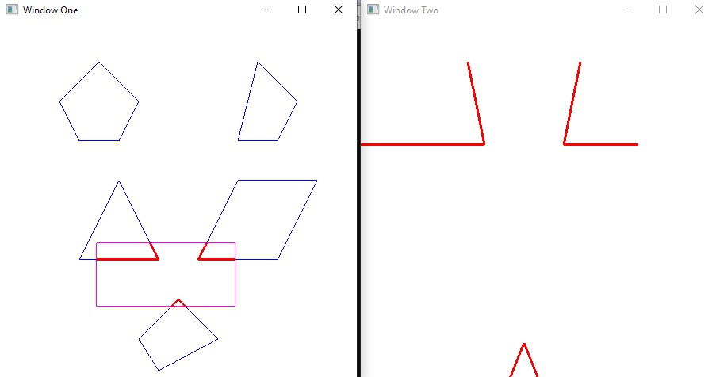

## Interactive polygon clipping using Cohen-Sutherland algorithm
In this project, we will implement an interactive polygon-clipping algorithm in OpenGL.

We will create two windows, the left one for displaying and clipping the
polygons and the right one for displaying the clipped polygons in a zoomed-in
view.

We will use Cohen-Sutherland line clipping algorithm for polygon clipping. 

We will be able to interactively change the size and position of the clipping
window using the mouse. For example, we will use the left mouse button to
move the clipping window and the right button to resize the window. After the
clipping window is modified, we will immediately update our clipping
results. Please note that the aspect ratios of the clipping window and the second
displaying window may be different.

#### Screenshot

#### Reference
Cohen-Sutherland algorithm tutoiral:

https://www.geeksforgeeks.org/line-clipping-set-1-cohen-sutherland-algorithm/